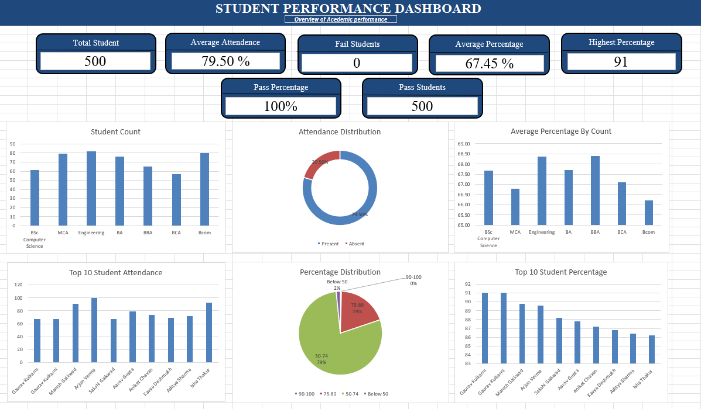

# Student Performance Dashboard

## 📊 Excel Data Analytics Project

This project analyzes student academic performance using Microsoft Excel and presents the insights through an interactive dashboard.

### 🛠️ Tools & Skills
- Microsoft Excel
- Data Cleaning
- Pivot Tables
- Data Analysis
- Data Visualization
- Dashboard Creation

### 📈 Dashboard Highlights
- Total Students: 500
- Average Attendance: 79.50%
- Average Percentage: 67.45%
- Pass Percentage: 100%
- Highest Percentage: 91
- Student-wise and course-wise performance analysis
- Attendance and percentage distribution

### 🎯 Project Objective
To analyze student performance data and create an interactive dashboard that helps identify academic trends, attendance patterns, and overall student performance.

### 📁 Project File
The Excel workbook contains the student dataset, analysis, pivot tables, and interactive dashboard.

## 📊 Dashboard Preview

